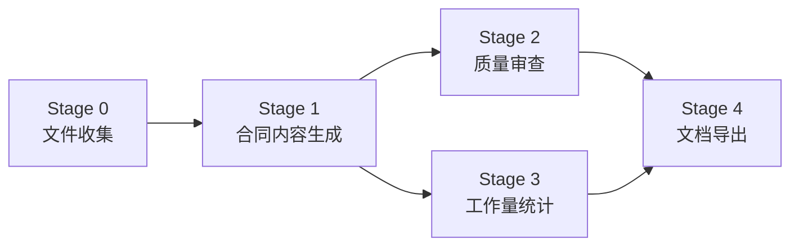

# AutoGenBackend — 合同生成后端服务

> FastAPI 驱动的合同智能生成引擎。接收前端请求，调用 DeepSeek LLM 生成 13 章中文服务合同，通过 WebSocket 实时推送进度，最终产出格式化的 DOCX 文档和审查/统计报告。

---

## 技术栈

| 技术 | 用途 |
|------|------|
| Python 3.11+ | 开发语言 |
| FastAPI + Uvicorn | Web 框架 + ASGI 服务器（端口 8002） |
| DeepSeek API | LLM 大模型（`deepseek-v4-pro`，OpenAI 兼容协议） |
| python-docx | DOCX 文档生成 |
| PyPDF2 / python-pptx / openpyxl | 多格式文档读取 |
| PyYAML | 配置文件解析 |
| WebSocket | 实时进度推送 |

完整架构设计请参阅 [architecture.md](architecture.md)。

## 快速开始

### 1. 环境准备

```bash
# 创建 Conda 环境（推荐）
conda create -n data python=3.11
conda activate data

# 安装依赖
pip install -r requirements.txt
```

### 2. 配置 API Key

编辑 `config.yaml`，填入 DeepSeek API Key：

```yaml
deepseek:
  api_key: "sk-your-api-key-here"
  model: "deepseek-v4-pro"
  temperature: 0.3
  max_tokens: 8192
```

> **注意**：`config.yaml` 包含 API Key 等敏感信息，已加入 `.gitignore`，请勿提交到版本控制。

### 3. 启动服务

```bash
python -m server.main
```

或双击 `启动后端.bat`

服务启动在 `http://0.0.0.0:8002`，Swagger API 文档自动生成在 `http://localhost:8002/docs`。

### 4. 验证

```bash
curl http://localhost:8002/api/health
# → {"status": "ok", "active_sessions": 0}
```

## 5 阶段流水线



| 阶段 | ID | 名称 | 说明 | 主要输出 |
|------|-----|------|------|----------|
| 0 | `file_collection` | 文件收集 | 读取 uploads/、profile/、templates/ 下的所有文件，解析 DOCX/PDF/PPTX 内容为文本 | `02_examples/`（文本缓存） |
| 1 | `contract_generation` | 合同内容生成 | 调用 DeepSeek LLM 一次性生成 13 章完整中文服务合同 | `03_contract/contract_full.md` |
| 2 | `quality_review` | 合同质量审查 | AI 审查完整性、合法性、格式一致性、数据一致性、可操作性 | `03_contract/review_report.md` |
| 3 | `workload_statistics` | 工作量统计 | AI 提取服务项目、交付物、里程碑、人员估算、工时汇总 | `03_contract/statistics.md` |
| 4 | `document_export` | 文档导出 | Markdown → DOCX 格式化（黑体标题、宋体正文、A4 标准），生成审查报告和统计报告 | `04_output/*.docx`、`*.md`、`*.json` |

> Stage 2 和 Stage 3 **并行执行**，通过 `ThreadPoolExecutor(max_workers=2)` 减少总耗时。

## API 端点

### 会话管理

| 方法 | 路径 | 说明 |
|------|------|------|
| POST | `/api/session` | 创建会话（不启动流水线） |
| POST | `/api/session/{id}/start` | 启动 5 阶段流水线 |
| GET | `/api/sessions` | 获取历史会话列表 |
| GET | `/api/session/{id}/cache-tree` | 获取工作区文件树（JSON） |
| GET | `/api/session/{id}/file-content` | 获取文件内容（支持 `?path=` 参数） |
| GET | `/api/session/{id}/docx-as-pdf` | DOCX/PPTX 转 PDF 预览 |
| GET | `/api/session/{id}/xlsx-as-json` | XLSX 转 JSON 数据 |

### 文件上传

| 方法 | 路径 | 说明 |
|------|------|------|
| POST | `/api/session/{id}/upload` | 上传文件（`?type=uploads\|profile`） |
| GET | `/api/session/{id}/uploads` | 列出已上传文件 |
| DELETE | `/api/session/{id}/uploads/{filename}` | 删除上传文件 |
| POST | `/api/session/{id}/delete-file` | 通过请求体指定路径删除文件 |

### 文件下载

| 方法 | 路径 | 说明 |
|------|------|------|
| GET | `/api/download/{id}/{file}` | 下载生成的合同/报告文件 |

### 全局参考文件

| 方法 | 路径 | 说明 |
|------|------|------|
| GET | `/api/profile` | 列出全局参考文档 |
| POST | `/api/profile/upload` | 上传参考文档到 `profile/` |
| DELETE | `/api/profile/{filename}` | 删除参考文档 |

### WebSocket

| 协议 | 路径 | 说明 |
|------|------|------|
| WS | `/ws/{session_id}` | 实时进度推送（心跳 15s） |

#### WebSocket 消息类型

| 类型 | 方向 | 说明 |
|------|------|------|
| `stage_definitions` | 服务端→客户端 | 连接建立后发送阶段定义 |
| `stage_start` | 服务端→客户端 | 阶段开始，含阶段 ID 和名称 |
| `stage_complete` | 服务端→客户端 | 阶段完成，含输出文件信息 |
| `stage_failed` | 服务端→客户端 | 阶段失败，含错误信息 |
| `echo` | 服务端→客户端 | 流水线运行日志（info/warn/error） |
| `pipeline_complete` | 服务端→客户端 | 全部阶段成功完成，含输出文件列表 |
| `pipeline_failed` | 服务端→客户端 | 致命错误导致流水线中断 |
| `keepalive` | 服务端→客户端 | 长耗时阶段每 30s 发送，防止代理超时 |
| `heartbeat` | 双向 | 每 15s 心跳保活 |
| `ping` / `pong` | 双向 | WebSocket 协议层保活 |

## 会话工作区结构

```
workspaces/sessions/{uuid}/
├── contract_config.json       # 表单配置数据
├── pipeline_state.json        # 流水线运行状态
├── uploads/                   # 用户上传的核心文件
│   └── user_input.md          # 用户文本输入（补充需求）
├── profile/                   # 用户上传的参考文件
├── templates/                 # 合同模板（启动时自动复制）
│   └── contract_template.md
├── 01_config/                 # Stage 0 配置缓存
├── 02_examples/               # Stage 0 文件文本缓存
│   ├── uploads/               # 核心文件转文本
│   └── profile/               # 参考文件转文本
├── 03_contract/               # Stage 1-3 生成产物
│   ├── contract_full.md       # 完整合同（Markdown）
│   ├── review_report.md       # 质量审查报告
│   └── statistics.md          # 工作量统计
├── 04_output/                 # Stage 4 最终输出
│   ├── {合同编号}.docx                # 格式化合同
│   ├── {合同编号}_审查报告.md          # 审查报告（Markdown）
│   ├── {合同编号}_审查报告.docx        # 审查报告（DOCX）
│   ├── {合同编号}_工作量统计.md        # 统计报告（Markdown）
│   └── {合同编号}_工作量统计.json      # 统计报告（结构化数据）
└── .temp/                     # 临时文件（PDF 转换缓存等）
```

会话具有 **24 小时 TTL**，过期后由后台定时任务（每 30 分钟）自动清理。

## 配置说明

### config.yaml — 主配置

| 配置项 | 说明 |
|--------|------|
| `deepseek.api_key` | DeepSeek API 密钥（**必填**） |
| `deepseek.model` | 模型名称，默认 `deepseek-v4-pro` |
| `deepseek.temperature` | 生成温度，默认 0.3 |
| `deepseek.max_tokens` | 最大输出 token 数，默认 8192 |
| `defaults` | 乙方公司默认名称等默认值 |
| `paths` | 模板、源文件、案例、输出目录路径 |
| `cache` | 会话存储目录和 TTL 设置 |
| `pipeline` | 流水线配置文件路径 |
| `contract_id` | 合同编号前缀和日期格式 |
| `llm_sections` | 合同 13 章节的占位符映射 |

### pipeline_config.yaml — 流水线配置

| 配置项 | 说明 |
|--------|------|
| `stages` | 5 个阶段的 ID、名称、描述、Skill 关联 |
| `parallel_stages` | 并行执行组（`[2, 3]`，即 Stage 2 和 3 并行） |
| `format` | DOCX 字体（黑体/宋体/Times New Roman）、字号、页边距、占位符格式 |
| `llm` | LLM 调用参数（model、temperature、max_tokens、重试次数） |

## 项目结构

```
AutoGenBackend/
├── server/                       # FastAPI 应用层
│   ├── main.py                   # 应用入口、CORS、路由注册、定时清理
│   ├── models.py                 # Pydantic 模型、阶段定义、WS 消息类型
│   ├── session_manager.py        # 会话生命周期（创建/更新/过期/清理）
│   ├── ws_manager.py             # WebSocket 连接管理（广播/心跳/重发）
│   ├── contract_adapter.py       # 5 阶段流水线编排器（核心）
│   ├── routes_contract.py        # 会话创建/启动 API
│   ├── routes_upload.py          # 文件上传/管理 API
│   ├── routes_download.py        # 会话列表/下载/DOCX 转 PDF API
│   ├── routes_ws.py              # WebSocket 端点
│   └── routes_profile.py         # 全局参考文件管理 API
│
├── src/                           # 核心库
│   ├── llm/
│   │   ├── deepseek_client.py    # DeepSeek API 客户端（流式调用、指数退避重试）
│   │   ├── prompt_builder.py     # Prompt 组装（上下文注入、截断控制）
│   │   └── prompts.py            # Prompt 模板和 13 章节定义
│   ├── document/
│   │   ├── generator.py          # DOCX 生成器（Markdown → Word 状态机）
│   │   ├── reader.py             # 多格式文档读取（DOCX/PDF/PPTX/XLSX/TXT/MD）
│   │   └── replacer.py           # 旧版 OOXML 模板替换（向后兼容）
│   ├── config/loader.py          # YAML 配置加载器（含验证）
│   └── utils/
│       ├── date_utils.py          # 中文日期处理（期限格式化、到期日计算）
│       └── xlsx_reader.py        # Excel 占位符映射表读取
│
├── lib/                           # 支持库
│   ├── skill_manager.py          # AI Skill 加载与 Prompt 构建
│   └── state_manager.py          # 流水线状态持久化（断点续跑支持）
│
├── skills/                        # AI Skill 定义
│   ├── contract-generate/        # 合同内容生成 Skill（v3.0.0）
│   ├── contract-review/          # 质量审查 Skill（v1.0.0）
│   ├── contract-statistics/      # 工作量统计 Skill（v1.0.0）
│   └── contract-all/             # 旧版一体式 Skill（v2.0.0，保留兼容）
│
├── templates/                     # 合同模板
│   └── contract_template.md      # Markdown 合同模板（13 章 + 占位符）
├── source/                        # 参考文档目录
├── 合同案例/                      # 历史合同案例（DOCX）
├── workspaces/                    # 会话工作区（运行时生成）
│   └── sessions_index.json       # 会话注册表
├── config.yaml                    # 主配置文件（含 API Key，已 gitignore）
├── pipeline_config.yaml           # 流水线配置
├── requirements.txt               # Python 依赖
├── architecture.md                # 架构设计文档
└── 启动后端.bat                   # Windows 启动脚本
```

## 关键设计决策

1. **三步操作流程**：创建会话 → 上传文件 → 启动生成。文件在流水线启动前全部上传完毕，确保流水线能读到完整数据。

2. **线程池异步执行**：合同生成在 `ThreadPoolExecutor` 中运行，通过 `asyncio.run_coroutine_threadsafe` 向主事件循环推送 WebSocket 消息。

3. **状态机 DOCX 生成**：[generator.py](src/document/generator.py) 使用 NORMAL / TABLE / CODE 三状态解析器，将 Markdown 准确转换为格式化 Word 文档，支持封面页、签名页、表格、加粗和代码块。

4. **并行审查与统计**：Stage 2（质量审查）和 Stage 3（工作量统计）通过 `ThreadPoolExecutor(max_workers=2)` 并行执行，有效减少总耗时。

5. **保活机制**：长耗时阶段（如 LLM 生成）每 30s 发送 keepalive 消息，防止 WebSocket 代理超时断开。

6. **优雅重连**：关键消息（如 `pipeline_failed`）发送失败时自动重试 3 次，确保前端能收到最终状态。

## 更多文档

- [architecture.md](architecture.md) — 详细架构设计文档（数据流、API 端点、设计决策）
- [../AutoGenContract/README.md](../AutoGenContract/README.md) — 前端界面文档
- [../README.md](../README.md) — 项目总览
